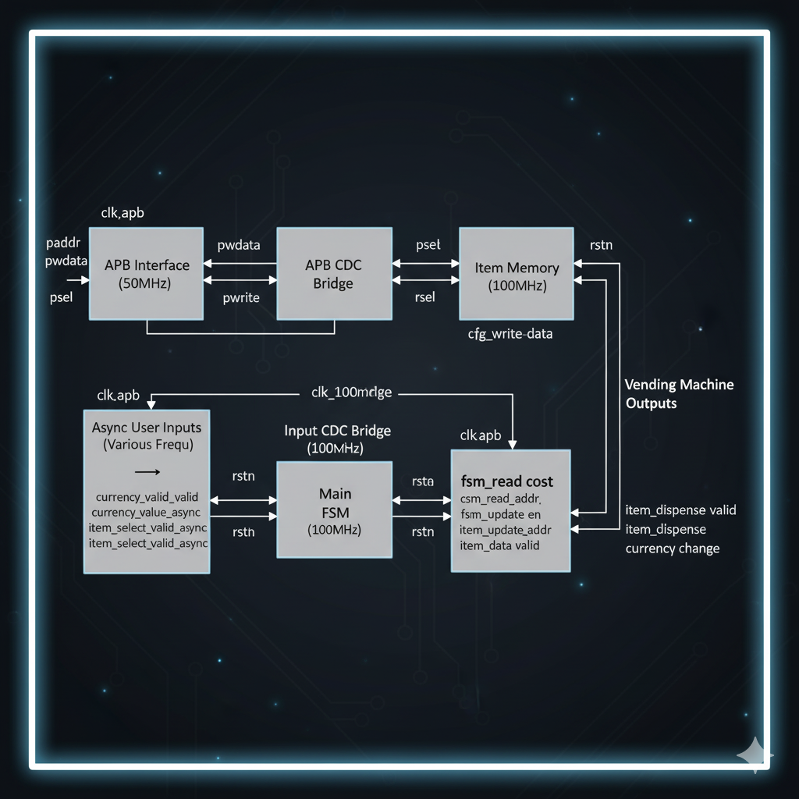

# FPGA Vending Machine Controller

  

<em>user interaction with a futuristic vending machine.FSM logic and real-world interface modeled in this project.</em>

A dual-clock domain FPGA design for a vending machine controller featuring an APB configuration interface, clock domain crossing (CDC) synchronizers, and a finite state machine (FSM) for transaction management.

## Key Features

- Dual clock domains: 50MHz APB interface and 100MHz FSM operation
- Finite State Machine for handling item selection, currency, dispensing, and change
- Safe asynchronous signal synchronization for user inputs and configuration
- Memory management for item costs, availability, and dispensing tracking

## Clock Domain Architecture
The design uses two clock domains:
- **50MHz APB domain:** Handles configuration and memory access via the APB protocol.
- **100MHz System domain:** Runs the main vending state machine and memory operations.
Clock domain crossing is ensured using dedicated CDC synchronizers and handshake mechanisms to safely transfer signals and data between these asynchronous domains.

## High-Level Block Diagram

## Module Overview
- **`vending_top.v`** : Top-level integration of all modules coordinating inputs, FSM, memory, and APB interface.
- **`main_fsm.v`** : Implements the finite state machine managing vending transactions and dispensing logic.
- **`item_memory.v`** :Dual-port memory storing item costs, availability, and dispensing state in the 100MHz domain.
- **`apb_cdc.v`** : Clock domain crossing bridge from APB (50MHz) to memory domain, enabling safe external configuration.
- **`input_cdc.v`** : Synchronizes asynchronous user inputs (currency, selections) into the FSM clock domain.

## Data Flow Summary
User inputs (currency and item selection) asynchronously enter the system and are synchronized by `input_cdc`. The FSM reads item information from `item_memory` and manages transaction states. Configuration and updates from outside (APB) cross into the memory domain via `apb_cdc`. Dispensing signals and change outputs are generated by the FSM to complete vending operations.

## Why This Project Matters
This controller demonstrates safe CDC design, FSM-based transaction logic, and APB integration—key skills for real-world SoC development.

## Getting Started

Clone the repository:

## Simulation
Use ModelSim or Vivado to simulate `vending_top.v`. Testbench included in `tb_vending.v`.

## Build
To synthesize:
1. Open project in Vivado
2. Add all source files
3. Set `vending_top` as top module
4. Generate bitstream

